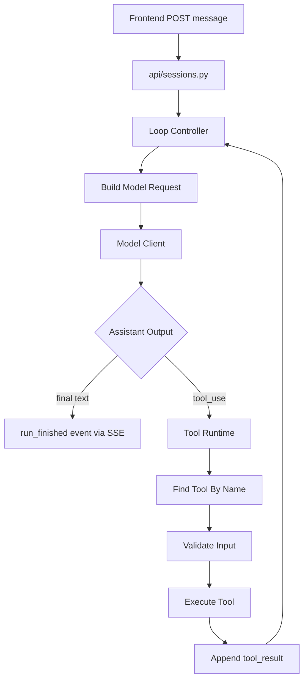
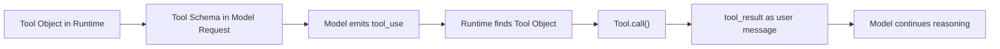
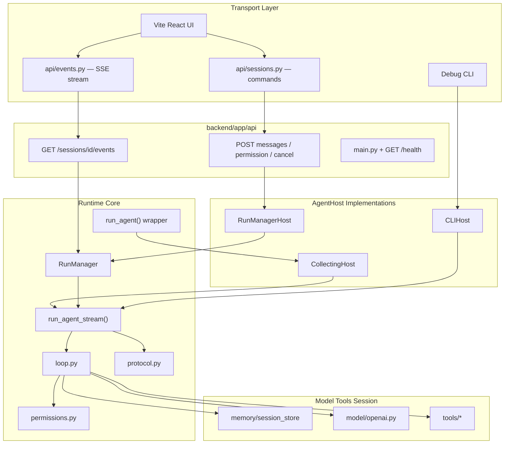

## 3. 最小架构与核心心智模型

### 3.1 V0.1 基线数据流（单请求）



### 3.2 核心心智模型



### 3.3 当前架构（V0.2.2 — AgentHost + HTTP/SSE）

传输层为 **FastAPI HTTP + SSE** + Debug CLI + Vite React 前端：

```text
┌──────────────────────────────────────────────────────────────┐
│  Transport 层                                                │
│  POST /api/sessions/{id}/messages  ·  GET .../events (SSE)   │
│  Debug CLI  ·  Vite / Electron frontend                      │
├──────────────────────────────────────────────────────────────┤
│  AgentHost 层（IO 抽象）                                      │
│  RunManagerHost  ·  CLIHost  ·  CollectingHost（测试包装）   │
├──────────────────────────────────────────────────────────────┤
│  Runtime Core                                                │
│  run_agent_stream  ·  RunManager  ·  protocol  ·  permissions│
│  loop  ·  messages  ·  prompts                               │
├──────────────────────────────────────────────────────────────┤
│  Model + Tools + Session                                     │
│  model/*  ·  tools/*  ·  memory/session_store                │
└──────────────────────────────────────────────────────────────┘
```



**关键路径说明：**

| 入口 | Host | Policy | 输出方式 |
| --- | --- | --- | --- |
| HTTP + SSE | `RunManagerHost` | `AskPolicy`（interactive）或 `risk_based` | SSE 步骤级事件流 + 权限 ask |
| Debug CLI | `CLIHost` | `AskPolicy` / `risk_based` / `allow_all` | 终端 trace + `[y/N]` |
| `run_agent()` 测试 | `CollectingHost` | 可注入 | 同步 `AgentResult` |

> **注意**：`run_agent_stream` 中的 stream 指 **runtime 步骤级事件流**，不是模型 token 流式输出（token streaming 仍属 V0.8 计划）。

> **历史**：V0.2.1～V0.2.2 过渡期曾用 `transport/ws_server.py`（WebSocket）；V0.2.3 已删除，统一 HTTP + SSE。详见 `docs/API.md`。
