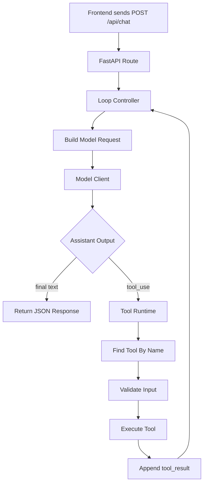
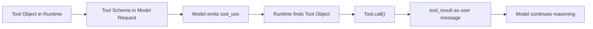

## 3. 最小架构与核心心智模型

```mermaid
flowchart TD
  A["Frontend sends POST /api/chat"] --> B["FastAPI Route"]
  B --> C["Loop Controller"]
  C --> D["Build Model Request"]
  D --> E["Model Client"]
  E --> F{"Assistant Output"}
  F -->|"final text"| G["Return JSON Response"]
  F -->|"tool_use"| H["Tool Runtime"]
  H --> I["Find Tool By Name"]
  I --> J["Validate Input"]
  J --> K["Execute Tool"]
  K --> L["Append tool_result"]
  L --> C
```

### 3.2 核心心智模型

```mermaid
flowchart LR
  A["Tool Object in Runtime"] --> B["Tool Schema in Model Request"]
  B --> C["Model emits tool_use"]
  C --> D["Runtime finds Tool Object"]
  D --> E["Tool.call()"]
  E --> F["tool_result as user message"]
  F --> G["Model continues reasoning"]
```
