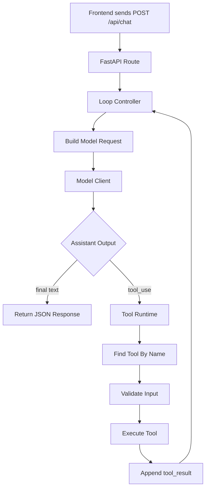

## 3. 最小架构

```mermaid
flowchart TD
  A["Frontend sends POST /api/chat"] --> B["FastAPI Route"]
  B --> C["Loop Controller"]
  C --> D["Build Model Request"]
  D --> E["Model Client"]
  E --> F{"Assistant Output"}
  F -->|"final text"| G["Return JSON Response"]
  F -->|"tool_use"| H["Tool Runtime"]
  H --> I["Find Tool By Name"]
  I --> J["Validate Input"]
  J --> K["Execute Tool"]
  K --> L["Append tool_result"]
  L --> C
```
