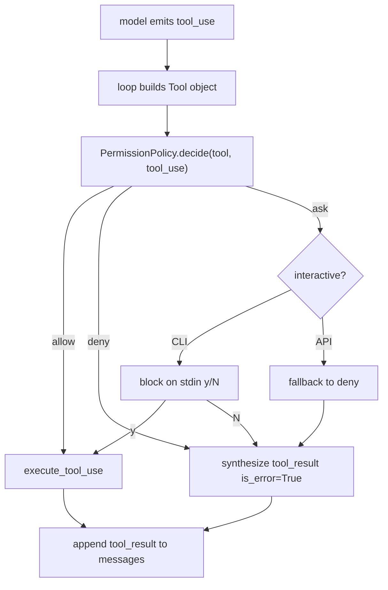

## 18. V0.2 — 工具权限层

> **版本状态：已完成（2026-05-19）** — Kgent 仓库已实现风险分级 + 三种策略 + decision trace；41 项 pytest 通过。

### 18.1 目标

在 `model → tool_use → [PERMISSION] → tool runtime` 这一环插入显式决策点，让 Kgent 具备 CC 范式的工具风险评估能力，为后续 V0.3 safe-tool 并发、V0.7 dynamic tool loading 打地基。

V0.2 **不**引入真实高危工具（`write_file` / `shell`）；只先把决策骨架做出来。

### 18.2 范式说明

```text
risk_level 是工具自带的元数据，不是策略本身。
PermissionPolicy 决定"看到 risk_level 后做什么"。
被拒/超时 → tool_result(is_error=True, content="permission_denied: ...") 回填模型。
risk_level 不投影给模型 schema（保持 §6 "runtime 保存完整 Tool 对象"原则）。
```

### 18.3 关键数据流



### 18.4 三种内置策略

| 策略 | 行为 | 用途 |
| --- | --- | --- |
| `AllowAllPolicy` | 全部允许 | 兼容 V0.1.x 旧行为；测试 fixture |
| `RiskBasedPolicy(allowed=("low","medium"))` | low/medium 允许，high 拒绝 | API 端默认 |
| `InteractivePolicy(asker)` | low 自动允许；medium/high 走异步 asker | Debug CLI |

`asker` 签名：`Callable[[Tool, ToolUseBlock], Awaitable[bool]]`。Debug CLI 用 `asyncio.to_thread(input, ...)` 阻塞读 `[y/N]`。

### 18.5 现有工具风险分级

| 工具 | risk_level | 说明 |
| --- | --- | --- |
| `calculator` | low | 无副作用，纯计算 |
| `list_files` | low | 只读目录列表 |
| `read_file` | medium | 读项目内文件（已有路径白名单/隐藏文件防护） |

### 18.6 AgentStep 协议增量（向后兼容）

```python
class AgentStep(BaseModel):
    type: Literal["think", "call", "observe", "final"]
    ...
    decision: Literal["allow", "deny", "ask"] | None = None  # 仅 call 步骤合法
```

非 `call` 步骤携带 `decision` 会在校验阶段抛错。旧客户端不传该字段不受影响。

### 18.7 配置

```text
KGENT_PERMISSION_MODE   # allow_all | risk_based | interactive
默认: risk_based
非法值: 回退到 risk_based
```

**API 端**：`interactive` 会被 `resolve_api_permission_mode()` 强制降级为 `risk_based`，避免 HTTP 长阻塞；`GET /health` 用 `effective_permission_mode` 字段显式标记降级。

**Debug CLI**：`--permission` 覆盖环境配置，可选 `allow_all / risk_based / interactive`，默认 `interactive`。

### 18.8 `/health` 响应（V0.2+）

```json
{
  "status": "ok",
  "provider": "heuristic",
  "available_providers": ["heuristic", "openai"],
  "model_client_ready": true,
  "permission_mode": "interactive",
  "effective_permission_mode": "risk_based",
  "tool_risks": {
    "calculator": "low",
    "list_files": "low",
    "read_file": "medium"
  }
}
```

### 18.9 实现进度表（V0.2）

| ID | 任务 | 状态 | 实现位置 | 验证 |
| --- | --- | --- | --- | --- |
| V0.2-1 | `Tool.risk_level` 字段 | [x] | `backend/app/tools/base.py` | `test_existing_tools_carry_risk_level` |
| V0.2-2 | `tool_to_schema` 不泄露 `risk_level` | [x] | 同上 | `test_tool_to_schema_does_not_leak_risk_level` |
| V0.2-3 | 现有三工具打标 | [x] | `calculator.py` / `list_files.py` / `read_file.py` | 同上 |
| V0.2-4 | `permissions.py`：决策结构 + 三策略 | [x] | `backend/app/runtime/permissions.py` | `test_*_policy_*` |
| V0.2-5 | `AgentStep.decision` 字段 + 校验 | [x] | `backend/app/runtime/messages.py` | `tests/test_agent_step.py` |
| V0.2-6 | `run_agent(policy=...)` 决策点 + 合成 `permission_denied` | [x] | `backend/app/runtime/loop.py` | `test_run_agent_denies_high_risk_*` |
| V0.2-7 | `after_permission` trace（仅非 allow） | [x] | 同上 | `test_run_agent_denies_high_risk_*` |
| V0.2-8 | `KGENT_PERMISSION_MODE` 配置项 + 校验 | [x] | `backend/app/core/config.py` + `.env.example` | `test_health_exposes_permission_mode_*` |
| V0.2-9 | API 端 `interactive → risk_based` 强制降级 | [x] | `backend/app/api/chat.py` | `test_resolve_api_permission_mode_downgrades_interactive` |
| V0.2-10 | Debug CLI `--permission` + stdin asker | [x] | `backend/app/cli/debug.py` | `test_debug_cli_permission_flag_advertises_mode` |
| V0.2-11 | `/health` 暴露 `permission_mode` + `tool_risks` | [x] | `backend/app/main.py` | `test_health_exposes_permission_mode_*` |
| V0.2-12 | spec / references / `.env.example` 同步 | [x] | 本章节 + auto-coder refs | `python .claude/skills/auto-coder/scripts/sync_spec.py --force` |

### 18.10 验收场景

**场景 A — risk_based 默认放行 medium**

```text
POST /api/chat  message="读取 README.md 并总结"
Expect:
  read_file (medium) → call.decision="allow" → observe 正常 → final
  steps 不含 after_permission trace
```

**场景 B — risk_based 拒绝 high（mock 工具）**

```text
注册一个 risk_level="high" 的测试工具
mock 模型输出 tool_use(name=mock_danger)
Expect:
  call.decision="deny"
  observe.is_error=True
  observe.content 以 "permission_denied:" 开头
  trace emit "after_permission"
  下一轮 final 给出说明
```

**场景 C — interactive CLI 拒绝路径**

```text
python -m app.debug_cli --permission interactive --once "读取 README.md"
asker stub 返回 False
Expect:
  read_file 被拒，observe.is_error=True
```

**场景 D — API 端 interactive 自动降级**

```text
KGENT_PERMISSION_MODE=interactive 启动 API
GET /health
Expect:
  permission_mode="interactive"
  effective_permission_mode="risk_based"
```

### 18.11 仍不在 V0.2 范围

- [x] HTTP + SSE 端异步审批（V0.2.2 已实现，见 §18.6）
- [ ] 真实高危工具（`write_file` / `shell` / `network`）
- [ ] 按 session 维护工具白名单 / 黑名单
- [ ] 审计日志持久化（多用户）
- [ ] 每个工具配置粒度的策略覆盖

### 18.12 已知边界

- HTTP `POST .../messages` 不阻塞等待最终答案；interactive ask 通过 SSE `permission_required` + `POST .../permission` 完成。
- SSE/HTTP 目前无鉴权，仅以 session_id 区分会话（见 `docs/API.md`）。
- API 配置 `interactive` 在部分路径仍可能降级为 `risk_based`（见 `deps.py`）。
- `RiskBasedPolicy(allowed=...)` 当前只在策略构造点配置；未来若要按 session/per-tool 微调，应在 V0.2.x 加入 `PolicyContext`。
- `decision` 字段仅出现在 `call` 步骤；模型本身看不到它（仍走 §6 schema 投影原则）。

---

## 18.5. V0.2.1 — 交互式 Runtime IO

> **版本状态：已完成（2026-05-20）** — Kgent 已实现 AgentHost 抽象 + 步骤级事件协议 + 交互式权限审批；pytest 覆盖 RunManager / protocol / HTTP runtime。

### 18.5.1 目标

把「一次性 HTTP 跑完 turn」重构为 **长生命周期 Runtime + 双向事件协议**，使 agent 可在工具调用前暂停、请求用户批准、等待后继续或取消。

架构总览见 **§3.3**。

### 18.5.2 非目标（仍不做）

- 模型 **token 级流式**输出（属 V0.8）
- 数据库 run 持久化
- 完整桌面 UI（仅协议 + 后端 runtime）
- 真实高危工具（`write_file` / `shell`）

### 18.5.3 核心组件

| 组件 | 路径 | 职责 |
| --- | --- | --- |
| `AgentHost` | `runtime/host.py` | loop 与外部 IO 的抽象边界 |
| `CollectingHost` | 同上 | HTTP 同步兼容，收集 events → JSON |
| `RunManagerHost` | `runtime/run_manager.py` | HTTP/SSE 监督式 run |
| `CLIHost` | `runtime/host.py` | Debug CLI stdin `[y/N]` |
| `protocol.py` | `runtime/protocol.py` | `AgentEvent` + client commands |
| `run_agent_stream()` | `runtime/loop.py` | 事件驱动核心 loop |
| `AskPolicy` | `runtime/permissions.py` | medium/high → `ask`，由 Host 解析 |
| `RunManager` | `runtime/run_manager.py` | pending permission / cancel / event history |
| `api/sessions.py` + `api/events.py` | `backend/app/api/` | HTTP 命令 + SSE 传输层 |

### 18.5.4 实现进度表（V0.2.1）

| ID | 任务 | 状态 | 实现位置 | 验证 |
| --- | --- | --- | --- | --- |
| V0.2.1-1 | `protocol.py` 事件 / command 模型 | [x] | `runtime/protocol.py` | `test_runtime_protocol.py` |
| V0.2.1-2 | `AgentHost` + `CollectingHost` / `CLIHost` | [x] | `runtime/host.py` | `test_agent_loop.py` |
| V0.2.1-3 | `run_agent_stream()` + `run_agent()` 兼容包装 | [x] | `runtime/loop.py` | `test_api.py` |
| V0.2.1-4 | `AskPolicy` + ask → `host.request_permission` | [x] | `permissions.py`, `loop.py` | `test_permissions.py` |
| V0.2.1-5 | `RunManager` 状态机 | [x] | `runtime/run_manager.py` | `test_run_manager.py` |
| V0.2.1-6 | HTTP/SSE 传输层 | [x] | `api/sessions.py`, `api/events.py`, `main.py` | `test_http_runtime.py` |
| V0.2.1-7 | Debug CLI 改 `CLIHost` | [x] | `cli/debug.py` | `test_debug_cli.py` |
| V0.2.1-8 | §3.3 架构图 + API §7.3 文档 | [x] | 本 spec | — |

### 18.5.5 验收场景

**场景 A — Debug CLI 向后兼容**：`CLIHost` + `[y/N]` 审批仍可用。

**场景 B — HTTP allow**：`POST .../messages` → SSE `permission_required(read_file)` → `POST .../permission(allow)` → SSE `run_finished`。

**场景 C — HTTP deny**：deny 后不执行工具，`observe.content` 以 `permission_denied:` 开头。

**场景 D — cancel waiting permission**：`cancel_run` → `run_cancelled`，不再继续 model/tool。

**场景 E — duplicate / unknown decision**：重复 resolve 或 unknown id → `error` event。

### 18.5.6 已知边界

- HTTP 发命令不阻塞等待最终答案；interactive ask 走 SSE + `POST .../permission`。
- Run state 仅进程内存；多 worker 不共享。
- `run_agent_stream` 的 stream = **步骤级事件**，不是 token streaming。
- `on_trace`（Debug CLI checkpoint）与 `host.emit` 双轨并存，后续可合并。

---

## 18.6 V0.2.2 — HTTP + SSE + Frontend

> **版本状态：已完成（2026-05-22）** — FastAPI 网络入口；Web + Notebook 可观测性；legacy WebSocket 已移除（§18.7）。

### 18.6.1 目标

- `backend/app/main.py` + `api/` 作为唯一网络入口（HTTP + SSE + `/health`）。
- Vite + React 前端通过 `useRuntimeHttp` 连接（`runtimeClient.ts` + SSE）。
- 生产默认 DeepSeek（`KGENT_PROVIDER=openai`）；pytest 用 `tests/fake_model.py`。
- `loop_checkpoint.before_model_call` 携带 `tool_schemas` 供调试 UI / Jupyter。
- 前端启动时 `POST /api/sessions` 分配随机 session id（或 `VITE_SESSION_ID` 覆盖）。

### 18.6.2 网络映射

| 能力 | 实现 |
| --- | --- |
| 发消息 / 启动 run | `POST /api/sessions/{id}/messages` |
| 权限决策 | `POST /api/runs/{id}/permission` |
| 取消 run | `POST /api/runs/{id}/cancel` |
| 事件流 | `GET /api/sessions/{id}/events` (SSE) |
| 健康检查 | `GET /health` |
| 可选 TLS 启动 | `scripts/run_server.py` + `KGENT_SSL_*` |

### 18.6.3 实现进度表

| ID | 任务 | 状态 | 实现位置 | 验证 |
| --- | --- | --- | --- | --- |
| V0.2.2-1 | FastAPI + HTTP 命令路由 | [x] | `api/sessions.py`, `main.py` | `test_http_runtime.py` |
| V0.2.2-2 | SSE 事件流 + 重连重放 | [x] | `api/events.py`, `run_manager.py` | `test_http_runtime.py` |
| V0.2.2-3 | Vite React 客户端 | [x] | `frontend/`, `useRuntimeHttp.ts` | vitest + 手动联调 |
| V0.2.2-4 | Loop trace UI（messages + tools[]） | [x] | `LoopTracePanel`, `loopStory.ts` | frontend tests |
| V0.2.2-5 | Jupyter checkpoint walkthrough | [x] | `notebooks/` | 手动 |
| V0.2.2-6 | 移除生产 heuristic | [x] | `tests/fake_model.py` | pytest |
| V0.2.2-7 | API 文档 | [x] | `docs/API.md` | 手动 |
| V0.2.2-8 | `KGENT_SESSION_EVENT_MAX` 安全解析 | [x] | `run_manager.py` | `test_run_manager.py` |

---

## 18.7 V0.2.3 — 移除 Legacy WebSocket

> **版本状态：已完成（2026-05-22）**

### 18.7.1 移除项

| 移除 | 说明 |
| --- | --- |
| `backend/app/transport/ws_server.py` | standalone WebSocket server |
| `tests/test_runtime_websocket.py` | WS 集成测试 |
| `tests/test_ws_four_turn_repro.py` | WS 四轮复现 |
| `frontend/src/lib/wsClient.ts` | 前端 WS 客户端 |
| `frontend/src/hooks/useRuntimeWs.ts` | WS hook |
| `websockets` Python 依赖 | `pyproject.toml` |
| `KGENT_WS_HOST` / `KGENT_WS_PORT` | `.env.example` |

### 18.7.2 保留

- `runtime/protocol.py` 中 `StartRunCommand` 等 command 模型（语义仍对应 HTTP 请求体）
- `tests/test_http_runtime.py` 作为网络层唯一集成测试

---

## Part C — Snapshot & Roadmap（现状快照与路线）
