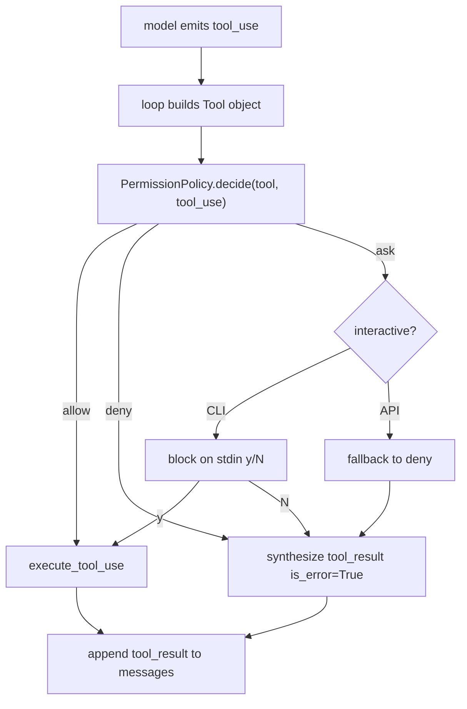

## 18. V0.2 — 工具权限层

> **版本状态：已完成（2026-05-19）** — Kgent 仓库已实现风险分级 + 三种策略 + decision trace；41 项 pytest 通过。

### 18.1 目标

在 `model → tool_use → [PERMISSION] → tool runtime` 这一环插入显式决策点，让 Kgent 具备 CC 范式的工具风险评估能力，为后续 V0.3 safe-tool 并发、V0.7 dynamic tool loading 打地基。

V0.2 **不**引入真实高危工具（`write_file` / `shell`）；只先把决策骨架做出来。

### 18.2 范式说明

```text
risk_level 是工具自带的元数据，不是策略本身。
PermissionPolicy 决定"看到 risk_level 后做什么"。
被拒/超时 → tool_result(is_error=True, content="permission_denied: ...") 回填模型。
risk_level 不投影给模型 schema（保持 §6 "runtime 保存完整 Tool 对象"原则）。
```

### 18.3 关键数据流



### 18.4 三种内置策略

| 策略 | 行为 | 用途 |
| --- | --- | --- |
| `AllowAllPolicy` | 全部允许 | 兼容 V0.1.x 旧行为；测试 fixture |
| `RiskBasedPolicy(allowed=("low","medium"))` | low/medium 允许，high 拒绝 | API 端默认 |
| `InteractivePolicy(asker)` | low 自动允许；medium/high 走异步 asker | Debug CLI |

`asker` 签名：`Callable[[Tool, ToolUseBlock], Awaitable[bool]]`。Debug CLI 用 `asyncio.to_thread(input, ...)` 阻塞读 `[y/N]`。

### 18.5 现有工具风险分级

| 工具 | risk_level | 说明 |
| --- | --- | --- |
| `calculator` | low | 无副作用，纯计算 |
| `list_files` | low | 只读目录列表 |
| `read_file` | medium | 读项目内文件（已有路径白名单/隐藏文件防护） |

### 18.6 AgentStep 协议增量（向后兼容）

```python
class AgentStep(BaseModel):
    type: Literal["think", "call", "observe", "final"]
    ...
    decision: Literal["allow", "deny", "ask"] | None = None  # 仅 call 步骤合法
```

非 `call` 步骤携带 `decision` 会在校验阶段抛错。旧客户端不传该字段不受影响。

### 18.7 配置

```text
KGENT_PERMISSION_MODE   # allow_all | risk_based | interactive
默认: risk_based
非法值: 回退到 risk_based
```

**API 端**：`interactive` 会被 `resolve_api_permission_mode()` 强制降级为 `risk_based`，避免 HTTP 长阻塞；`GET /health` 用 `effective_permission_mode` 字段显式标记降级。

**Debug CLI**：`--permission` 覆盖环境配置，可选 `allow_all / risk_based / interactive`，默认 `interactive`。

### 18.8 `/health` 响应（V0.2+）

```json
{
  "status": "ok",
  "provider": "heuristic",
  "available_providers": ["heuristic", "openai"],
  "model_client_ready": true,
  "permission_mode": "interactive",
  "effective_permission_mode": "risk_based",
  "tool_risks": {
    "calculator": "low",
    "list_files": "low",
    "read_file": "medium"
  }
}
```

### 18.9 实现进度表（V0.2）

| ID | 任务 | 状态 | 实现位置 | 验证 |
| --- | --- | --- | --- | --- |
| V0.2-1 | `Tool.risk_level` 字段 | [x] | `backend/app/tools/base.py` | `test_existing_tools_carry_risk_level` |
| V0.2-2 | `tool_to_schema` 不泄露 `risk_level` | [x] | 同上 | `test_tool_to_schema_does_not_leak_risk_level` |
| V0.2-3 | 现有三工具打标 | [x] | `calculator.py` / `list_files.py` / `read_file.py` | 同上 |
| V0.2-4 | `permissions.py`：决策结构 + 三策略 | [x] | `backend/app/runtime/permissions.py` | `test_*_policy_*` |
| V0.2-5 | `AgentStep.decision` 字段 + 校验 | [x] | `backend/app/runtime/messages.py` | `tests/test_agent_step.py` |
| V0.2-6 | `run_agent(policy=...)` 决策点 + 合成 `permission_denied` | [x] | `backend/app/runtime/loop.py` | `test_run_agent_denies_high_risk_*` |
| V0.2-7 | `after_permission` trace（仅非 allow） | [x] | 同上 | `test_run_agent_denies_high_risk_*` |
| V0.2-8 | `KGENT_PERMISSION_MODE` 配置项 + 校验 | [x] | `backend/app/core/config.py` + `.env.example` | `test_health_exposes_permission_mode_*` |
| V0.2-9 | API 端 `interactive → risk_based` 强制降级 | [x] | `backend/app/api/chat.py` | `test_resolve_api_permission_mode_downgrades_interactive` |
| V0.2-10 | Debug CLI `--permission` + stdin asker | [x] | `backend/app/cli/debug.py` | `test_debug_cli_permission_flag_advertises_mode` |
| V0.2-11 | `/health` 暴露 `permission_mode` + `tool_risks` | [x] | `backend/app/main.py` | `test_health_exposes_permission_mode_*` |
| V0.2-12 | spec / references / `.env.example` 同步 | [x] | 本章节 + auto-coder refs | `python .claude/skills/auto-coder/scripts/sync_spec.py --force` |

### 18.10 验收场景

**场景 A — risk_based 默认放行 medium**

```text
POST /api/chat  message="读取 README.md 并总结"
Expect:
  read_file (medium) → call.decision="allow" → observe 正常 → final
  steps 不含 after_permission trace
```

**场景 B — risk_based 拒绝 high（mock 工具）**

```text
注册一个 risk_level="high" 的测试工具
mock 模型输出 tool_use(name=mock_danger)
Expect:
  call.decision="deny"
  observe.is_error=True
  observe.content 以 "permission_denied:" 开头
  trace emit "after_permission"
  下一轮 final 给出说明
```

**场景 C — interactive CLI 拒绝路径**

```text
python -m app.debug_cli --permission interactive --once "读取 README.md"
asker stub 返回 False
Expect:
  read_file 被拒，observe.is_error=True
```

**场景 D — API 端 interactive 自动降级**

```text
KGENT_PERMISSION_MODE=interactive 启动 API
GET /health
Expect:
  permission_mode="interactive"
  effective_permission_mode="risk_based"
```

### 18.11 仍不在 V0.2 范围

- [ ] HTTP 端异步审批接口（前端在 `ask` 阶段轮询/回复）
- [ ] 真实高危工具（`write_file` / `shell` / `network`）
- [ ] 按 session 维护工具白名单 / 黑名单
- [ ] 审计日志持久化（多用户）
- [ ] 每个工具配置粒度的策略覆盖

### 18.12 已知边界

- API 端无法触发 `ask`，配置为 `interactive` 也会降级为 `risk_based`；这是为了不让 HTTP 请求长阻塞。要支持 HTTP ask，需要在 V0.2.x 引入异步审批接口。
- `RiskBasedPolicy(allowed=...)` 当前只在策略构造点配置；未来若要按 session/per-tool 微调，应在 V0.2.x 加入 `PolicyContext`。
- `decision` 字段仅出现在 `call` 步骤；模型本身看不到它（仍走 §6 schema 投影原则）。

---

## Part C — Snapshot & Roadmap（现状快照与路线）
