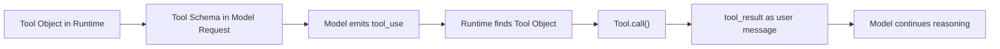

## 19. V0.1 核心心智模型

```mermaid
flowchart LR
  A["Tool Object in Runtime"] --> B["Tool Schema in Model Request"]
  B --> C["Model emits tool_use"]
  C --> D["Runtime finds Tool Object"]
  D --> E["Tool.call()"]
  E --> F["tool_result as user message"]
  F --> G["Model continues reasoning"]
```
