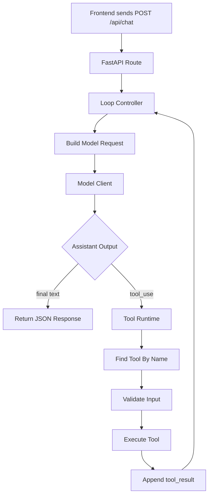
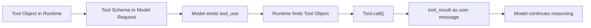

# Mini Agent V0.1 DEV Spec

## 1. 目标

实现一个 Python + FastAPI 版本的最小可运行 agent runtime，用来复刻 Claude Code agent loop 的核心骨架。

V0.1 不追求强大，只追求把下面这条链路跑通：

```text
user input
  -> messages + tools schema
  -> model
  -> tool_use
  -> runtime executes tool
  -> tool_result back to messages
  -> model
  -> final answer
```

核心学习目标：

```text
模型不是 agent。
agent = model + context + tools + runtime + loop controller。
```

## 2. 非目标

V0.1 暂不实现：

- 工具并发调度
- 权限审批系统
- 上下文压缩
- 长期记忆
- MCP
- 动态工具加载
- 流式输出
- 多模型 provider
- 复杂 UI / REPL
- 数据库存储
- 用户登录系统
- 自动任务规划

这些能力留给 V0.2 之后逐步加入。

## 3. 最小架构



## 4. 模块划分

建议目录：

```text
mini-agent/
  backend/
    app/
      main.py
      api/
        chat.py
      agent/
        loop.py
        messages.py
        model_client.py
        prompts.py
      tools/
        base.py
        registry.py
        calculator.py
        read_file.py
        list_files.py
      core/
        config.py
    pyproject.toml
  frontend/
    README.md
```

模块职责：

| 模块 | 职责 |
| --- | --- |
| `main.py` | FastAPI 应用入口 |
| `api/chat.py` | HTTP 接口，接收前端请求 |
| `agent/loop.py` | 控制 model-tool-model 循环 |
| `agent/model_client.py` | 封装模型请求 |
| `agent/messages.py` | 定义 message / tool_use / tool_result 数据结构 |
| `agent/prompts.py` | 存放 system prompt |
| `tools/base.py` | 定义 Tool 基类 / 协议 |
| `tools/registry.py` | 注册工具并提供 `find_tool_by_name()` |
| `tools/*.py` | 具体工具实现 |
| `core/config.py` | 环境变量和运行配置 |

## 5. Message 协议

V0.1 使用四类消息：

```python
from typing import Literal
from pydantic import BaseModel

class ToolUseBlock(BaseModel):
    type: Literal["tool_use"] = "tool_use"
    id: str
    name: str
    input: dict

class ToolResultBlock(BaseModel):
    type: Literal["tool_result"] = "tool_result"
    tool_use_id: str
    content: str
    is_error: bool = False

class Message(BaseModel):
    role: Literal["system", "user", "assistant"]
    content: str | list[ToolUseBlock] | list[ToolResultBlock]
```

`tool_use` 由 assistant 产生：

```json
{
  "type": "tool_use",
  "id": "toolu_123",
  "name": "read_file",
  "input": {
    "path": "README.md"
  }
}
```

`tool_result` 作为 user message 回填。

关键原则：

```text
assistant = 模型意图
tool_result = 外部观察
```

## 6. Tool 接口

V0.1 的 Tool 只保留最小字段：

```python
from typing import Protocol

class Tool(Protocol):
    name: str
    description: str
    input_schema: dict

    async def call(self, input: dict) -> str:
        ...
```

模型看到的是 schema 投影：

```python
def tool_to_schema(tool: Tool) -> dict:
    return {
        "name": tool.name,
        "description": tool.description,
        "input_schema": tool.input_schema,
    }
```

内部设计原则：

```text
runtime 保存完整 Tool 对象。
model request 只接收 ToolSchema。
```

## 7. FastAPI API 设计

V0.1 只需要一个接口：

```http
POST /api/chat
```

请求：

```json
{
  "message": "请读取 README.md 并总结这个项目"
}
```

响应：

```json
{
  "answer": "这个项目是...",
  "steps": [
    {
      "type": "tool_use",
      "name": "read_file",
      "input": {
        "path": "README.md"
      }
    },
    {
      "type": "tool_result",
      "name": "read_file",
      "content": "..."
    }
  ]
}
```

`steps` 是为了给前端展示 agent loop 过程，方便做成学习型项目。

## 8. V0.1 内置工具

先实现 3 个工具：

| 工具 | 作用 | 风险等级 |
| --- | --- | --- |
| `calculator` | 计算简单数学表达式 | low |
| `list_files` | 列出当前工作目录文件 | low |
| `read_file` | 读取指定文件内容 | medium |

暂不实现 `write_file`，避免 V0.1 一上来引入文件写入权限问题。

## 9. Agent Loop 伪代码

```python
async def run_agent(user_input: str) -> AgentResult:
    messages = [
        Message(role="system", content=SYSTEM_PROMPT),
        Message(role="user", content=user_input),
    ]

    steps = []

    for step in range(MAX_STEPS):
        response = await call_model(
            messages=messages,
            tools=[tool_to_schema(tool) for tool in TOOLS],
        )

        messages.append(response.assistant_message)

        if not response.tool_uses:
            return AgentResult(answer=response.text, steps=steps)

        for tool_use in response.tool_uses:
            steps.append({
                "type": "tool_use",
                "name": tool_use.name,
                "input": tool_use.input,
            })

            result = await execute_tool_use(tool_use)

            steps.append({
                "type": "tool_result",
                "name": tool_use.name,
                "content": result.content,
                "is_error": result.is_error,
            })

            messages.append(Message(
                role="user",
                content=[ToolResultBlock(
                    tool_use_id=tool_use.id,
                    content=result.content,
                    is_error=result.is_error,
                )],
            ))

    raise RuntimeError("Agent stopped: max steps reached")
```

## 10. 前端 V0.1 范围

前端只需要一个最小页面：

```text
输入框
发送按钮
最终回答区域
步骤展示区域
```

推荐展示结构：

```text
User: 请读取 README.md 并总结

Agent Step 1:
  tool_use: read_file({ path: "README.md" })

Agent Step 2:
  tool_result: README.md content...

Final Answer:
  这个项目是...
```

前端不需要实现复杂聊天历史。V0.1 可以先做单轮请求。

## 11. 执行规则

V0.1 先全部串行执行：

```text
模型一次输出多个 tool_use
  -> 按输出顺序逐个执行
  -> 每个结果都追加为 tool_result
  -> 再进入下一轮模型请求
```

不做 safe / unsafe 并发分类。

## 12. 错误处理

工具执行失败时，不直接让程序崩溃，而是把错误作为 `tool_result` 返回给模型：

```python
ToolResultBlock(
    tool_use_id=tool_use.id,
    content="Error: file not found",
    is_error=True,
)
```

这样模型可以根据错误继续修正下一步动作。

## 13. 安全边界

V0.1 的安全策略：

- `read_file` 只能读取项目目录内文件
- 禁止读取绝对路径
- 禁止读取包含 `..` 的路径
- 禁止执行 shell 命令
- 禁止写文件
- `max_steps` 默认设置为 8，防止无限循环

## 14. 验收标准

V0.1 完成后，必须能通过下面三个场景：

### 场景 1：纯文本回答

用户输入：

```text
介绍一下你自己
```

期望：

```text
模型直接回答，不调用工具。
```

### 场景 2：调用计算工具

用户输入：

```text
帮我算一下 12 * 8 + 6
```

期望：

```text
模型输出 calculator tool_use。
runtime 执行 calculator。
tool_result 回填。
模型给出最终答案。
前端展示 tool_use 和 tool_result 两个步骤。
```

### 场景 3：读取文件

用户输入：

```text
请读取 README.md 并总结这个项目
```

期望：

```text
模型输出 read_file tool_use。
runtime 读取 README.md。
tool_result 回填。
模型基于文件内容总结。
前端展示 read_file 的调用过程。
```

## 15. 后续版本路线

```text
V0.1: FastAPI + 最小 agent loop + 串行工具调用
V0.2: 工具权限层 + read/write 风险分级
V0.3: safe tools 并发执行
V0.4: context builder + system/user context 分层
V0.5: context compression
V0.6: memory management
V0.7: dynamic tool loading
V0.8: streaming output / streaming tool execution
V0.9: WebSocket / SSE 实时步骤输出
```

## 16. V0.1 核心心智模型



## 17. Implementation Status - 2026-05-19

This section records what the current repository has implemented.

### 17.1 Current File Layout

```text
backend/app/
  main.py
  api/
    chat.py
  agent/
    loop.py
    messages.py
    model_client.py
    prompts.py
    model/
      __init__.py
      base.py
      heuristic.py
      openai.py
  tools/
    base.py
    registry.py
    calculator.py
    list_files.py
    read_file.py
  core/
    config.py

frontend/
  README.md

tests/
  test_agent_loop.py
  test_api.py
  test_tools.py
```

### 17.2 Implemented Backend Capabilities

- [x] FastAPI app entrypoint in `backend/app/main.py`.
- [x] Health endpoint: `GET /health`.
- [x] Chat endpoint: `POST /api/chat`.
- [x] Pydantic request/response models for chat API.
- [x] Minimal model-tool-model loop in `agent/loop.py`.
- [x] Message protocol models in `agent/messages.py`.
- [x] Tool protocol and schema projection in `tools/base.py`.
- [x] Runtime tool registry helpers in `tools/registry.py`.
- [x] Built-in `calculator` tool.
- [x] Built-in `list_files` tool.
- [x] Built-in `read_file` tool.
- [x] Project-root path guard for file tools.
- [x] Tool execution errors are returned as `tool_result` blocks instead of crashing the loop.
- [x] `max_steps` guard in the agent loop.
- [x] Frontend-friendly step trace containing `tool_use` and `tool_result`.

### 17.3 Implemented Model Layer

- [x] `ModelClientProtocol` boundary.
- [x] `ModelClientError` for provider/network/parse failures.
- [x] Pluggable model client registry with `register_model_client()`.
- [x] Backward-compatible `agent/model_client.py` re-export module.
- [x] Offline deterministic `heuristic` model client.
- [x] OpenAI-compatible model client using Chat Completions and tool calls.
- [x] OpenAI-compatible message/tool conversion helpers.
- [x] Invalid model tool-call JSON is wrapped as `ModelClientError`.
- [x] API maps `ModelClientError` to HTTP 502.

### 17.4 Implemented Configuration

- [x] Runtime settings live in `core/config.py`.
- [x] Configuration source order is:

```text
environment variables -> .env -> built-in defaults
```

- [x] Supported variables:

```text
KGENT_PROVIDER
KGENT_MODEL
KGENT_API_KEY
KGENT_BASE_URL
KGENT_MAX_STEPS
KGENT_PROJECT_ROOT
KGENT_CORS_ORIGINS
```

- [x] `.env` is parsed without mutating `os.environ`.
- [x] `settings.json` is no longer part of the configuration path.
- [x] `.env.example` documents the supported variables.
- [x] CORS origins are configurable via `KGENT_CORS_ORIGINS`.
- [x] File tools block hidden paths such as `.env` and `.git/config`.

### 17.5 Implemented Tests

- [x] Tool unit tests for calculator and read-file path traversal.
- [x] Agent-loop tests for calculator and read-file flows.
- [x] API test for `/api/chat` calculator flow.
- [x] API test pins `KGENT_PROVIDER=heuristic` so local real-model config does not affect tests.

Current test command:

```bash
.venv\Scripts\python.exe -m pytest -q
```

Current result:

```text
9 passed
```

### 17.6 Still Not Implemented

These remain out of scope for the current V0.1 implementation:

- [ ] Real frontend UI beyond `frontend/README.md`.
- [ ] Streaming model output.
- [ ] Streaming tool execution.
- [ ] Tool permission approval flow.
- [ ] Safe/unsafe tool risk categories.
- [ ] Parallel tool execution.
- [ ] Dynamic tool loading.
- [ ] MCP integration.
- [ ] Context compression.
- [ ] Long-term memory.
- [ ] Persistent conversation storage.
- [ ] User authentication.

### 17.7 Current Known Risks

- `OpenAIModelClient` is built per request by the chat route; this is simple, but app-level dependency/lifespan management would be better for production.
- `KGENT_PROVIDER` is free-form and invalid values fail at request time with HTTP 502; configuration validation could fail earlier during startup.
- `DEV_SPEC.md` contains legacy mojibake text from earlier edits; new status notes are kept in ASCII to avoid worsening encoding issues.

一句话总结：

```text
V0.1 要证明：只要有 messages、tools schema、runtime、loop controller，
我们就已经拥有了一个最小 agent。
```
