# Claude Code 范式学习笔记

> 目标：通过学习 Claude Code 这类生产级 agent runtime 的设计，抽象出可迁移的智能体工程范式，并最终实现一个自己的 agent 应用项目，用于实习求职展示。

## 0. 学习路线

这份笔记按照“从最小模型到复杂系统”的方式持续扩展：

1. 最小 agent loop 心智模型
2. 消息结构：system / user / assistant / tool_result
3. 工具调用：tool_use -> runtime -> tool_result
4. 工具调度：异步、并发、串行、安全判断
5. 流式工具执行：latency 优化
6. Prompt / Context Builder：一次模型请求到底包含什么
7. Context Compression：长任务如何不爆上下文
8. Memory Management：长期记忆如何设计与召回
9. Persistence / Resume：状态如何持久化和恢复
10. Observability / Trace：如何观察 agent 的每一步
11. Error Recovery / Retry：失败后如何恢复
12. 自己的 agent 项目设计

### 0.1 全局学习图谱

这份笔记不是按源码文件顺序学习，而是按 agent runtime 的“复杂度递增”学习：

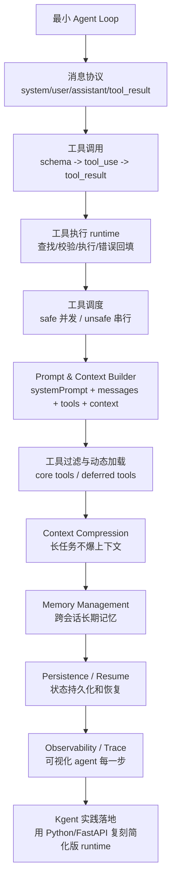

学习方法：

```text
Claude Code 负责提供生产级参考范式。
Kgent 负责把范式转成自己的工程实现。
```

### 0.2 双仓库工作流

当前采用“双仓库联动”的学习-实践方式：

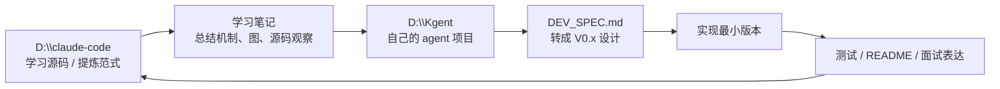

每学一个机制，都按下面格式落地：

```text
1. CC 是怎么做的？
2. 这个机制解决什么问题？
3. 抽象成什么通用设计？
4. Kgent 里如何简化实现？
5. 用什么测试证明它跑通？
```

## 1. 最小 Agent Loop 模型

最小模型不是指 AI model，而是“最简化的心智模型”。

Claude Code 这类 agent 的本质不是模型一次性回答，而是一个循环：

```text
用户输入
  -> 模型输出
  -> 如果模型请求 tool_use，runtime 执行工具
  -> 工具结果以 tool_result 返回给模型
  -> 模型继续决定下一步
  -> 直到模型不再请求工具，输出最终回答
```

更短地说：

```text
Model -> Tool -> Model -> Tool -> Model -> Final Answer
```

### 1.1 最小循环图

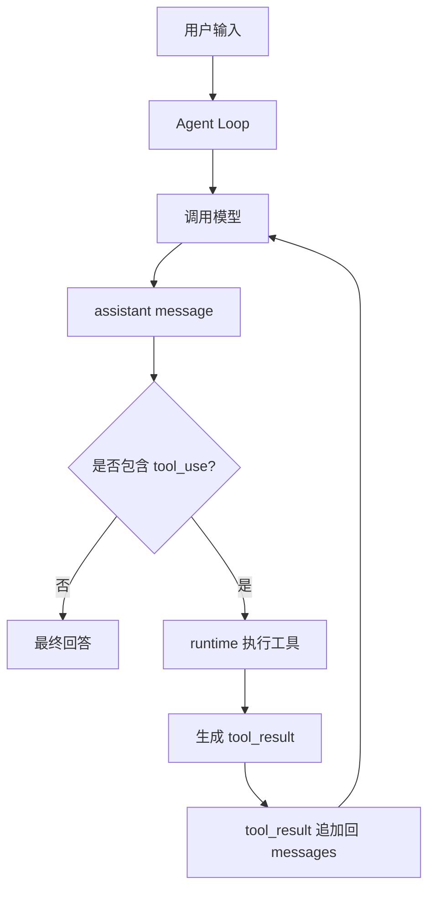

核心认知：

```text
模型不会直接改变外部世界。
模型只能提出 tool_use。
runtime 执行工具。
tool_result 把外部观察结果返回给模型。
```

## 2. Agent 的基础组成

一个最小可工作的 agent runtime 至少包含：

1. system prompt
2. messages history
3. tools registry
4. tool schema
5. tool execution runtime
6. permission / safety layer
7. loop controller

如果要做一个长期可用、生产级的 agent，还需要继续扩展：

1. context compression / compaction
2. memory management
3. state persistence / resume
4. observability / tracing
5. error recovery / retry

可以先记成：

```text
Agent = System Prompt + Tools + Message Loop
```

### 2.1 基础架构图

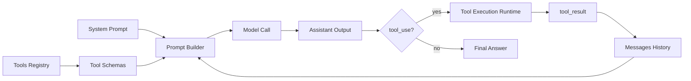

更完整一点：

```text
Production Agent =
  Prompt Builder
  + Message Store
  + Tool Registry
  + Tool Executor
  + Permission Layer
  + Loop Controller
  + Context Compactor
  + Memory Store
  + Persistence
  + Trace / Debug UI
  + Retry / Recovery
```

## 3. 消息角色

在 agent 内部，可以先理解为四类信息：

```text
system
user
assistant
tool_result
```

更精确地说，`tool_result` 通常不是独立的顶层 role，而是放在 `user` message 里的 content block。

### 3.1 system

`system` 是最高层规则，定义：

```text
agent 是谁
agent 应该如何工作
agent 可以使用哪些工具
agent 应该遵守哪些安全和权限约束
agent 不应该做什么
```

### 3.2 user

`user` 可以是用户真实输入，也可以承载工具结果。

例如：

```text
user:
  "帮我看看 package.json 里有哪些 scripts"
```

或者：

```text
user:
  tool_result:
    tool_use_id: "toolu_123"
    content: "package.json 内容是 ..."
```

### 3.3 assistant

`assistant` 是模型输出。

它可能包含普通文本：

```text
assistant:
  "我先检查 package.json。"
```

也可能包含工具调用：

```text
assistant:
  tool_use:
    id: "toolu_123"
    name: "Read"
    input:
      file_path: "package.json"
```

### 3.4 tool_result

`tool_result` 是外部工具执行后的观察结果。

关键理解：

```text
assistant = 模型意图
tool_result = 外部观察
```

这两个不能混淆。工具不是模型自身推理出的内容，而是外部世界返回的事实。

完整因果链是：

```text
assistant: 我要调用 Read(package.json)
runtime: 执行 Read
user/tool_result: Read 的结果是 ...
assistant: 基于结果继续回答
```

## 4. 一次工具调用的消息流

用户输入：

```text
帮我看看 package.json 里面有什么 scripts
```

第一轮发给模型：

```text
messages:
  user:
    帮我看看 package.json 里面有什么 scripts
```

模型输出：

```text
assistant:
  tool_use:
    id: "toolu_1"
    name: "Read"
    input:
      file_path: "package.json"
```

runtime 执行工具后生成：

```text
user:
  tool_result:
    tool_use_id: "toolu_1"
    content: "{ package.json 内容 }"
```

第二轮发给模型：

```text
messages:
  user:
    帮我看看 package.json 里面有什么 scripts

  assistant:
    tool_use:
      id: "toolu_1"
      name: "Read"
      input:
        file_path: "package.json"

  user:
    tool_result:
      tool_use_id: "toolu_1"
      content: "{ package.json 内容 }"
```

模型最终回答：

```text
assistant:
  "这个项目有 dev、build、test 等 scripts..."
```

如果这次没有新的 `tool_use`，agent loop 结束。

### 4.1 tool_use / tool_result 时序图

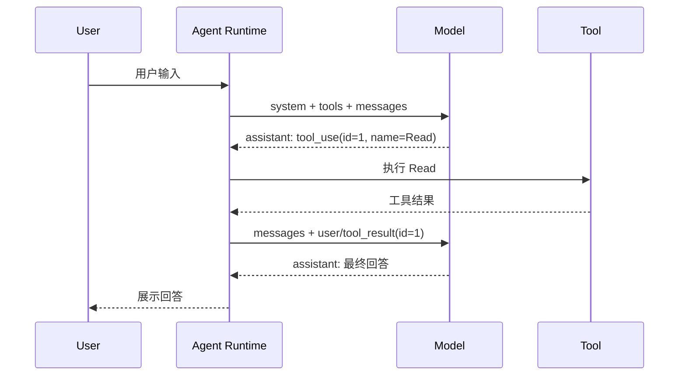

## 5. 异步与并发

Claude Code 里的模型调用和工具调用都是异步的。

模型调用通常是 streaming：

```ts
for await (const message of callModel(...)) {
  // 边接收模型输出，边处理
}
```

工具调用也是异步的，因为工具可能涉及：

```text
文件系统
Shell / PowerShell
网络请求
MCP 调用
子 agent
外部服务
```

但要区分：

```text
异步 != 一定并发
```

工具即使一个个执行，也可以是 async/await；并发指的是多个工具同时运行。

## 6. 工具并发调度

模型只决定：

```text
我要调用什么工具
工具 input 是什么
```

模型不决定：

```text
这些工具是否可以并发
这些工具是否必须串行
```

真正的调度由 agent runtime 决定。

### 6.1 runtime 是什么

这里的 `runtime` 指模型外面的执行系统，大致包括：

```text
queryLoop()
  -> toolOrchestration / StreamingToolExecutor
  -> runToolUse()
  -> 具体 Tool.call()
```

runtime 负责：

```text
查找工具
校验工具输入
判断权限
判断并发安全
执行工具
收集 tool_result
把结果追加回 messages
进入下一轮模型请求
```

### 6.2 如何判断工具是否并发安全

每个工具定义里可以声明：

```ts
isConcurrencySafe(input): boolean
```

runtime 收到 `tool_use` 后：

```text
1. 根据 tool_use.name 找到工具定义
2. 用工具的 inputSchema 解析 tool_use.input
3. 调用 tool.isConcurrencySafe(parsedInput)
4. true -> 可以和其他 safe 工具并发
5. false / 解析失败 / 抛异常 -> 保守处理，串行
```

默认策略是 fail closed：

```text
工具没有声明 isConcurrencySafe -> false
inputSchema 解析失败 -> false
isConcurrencySafe 抛错 -> false
```

也就是说，除非工具明确证明自己安全，否则默认不并发。

### 6.3 例子

读文件通常安全：

```text
FileReadTool.isConcurrencySafe() -> true
```

搜索通常安全：

```text
GrepTool.isConcurrencySafe() -> true
```

Bash 比较特殊，它会根据命令判断：

```text
Bash("ls")       -> 可能 safe
Bash("cat a.ts") -> 可能 safe
Bash("rm a.ts")  -> unsafe
Bash("npm test") -> 通常保守处理
```

写文件默认 unsafe：

```text
FileWriteTool -> 默认 isConcurrencySafe false
```

### 6.4 普通模式下的分批规则

工具调用按照模型输出顺序切 batch：

```text
连续 safe 工具 -> 合并成一个并发批次
unsafe 工具 -> 单独成为一个串行批次
```

例如：

```text
Read(a)   safe
Grep(foo) safe
Write(b) unsafe
Read(c)   safe
Read(d)   safe
```

会变成：

```text
Batch 1: Read(a), Grep(foo)   并发
Batch 2: Write(b)             串行
Batch 3: Read(c), Read(d)     并发
```

注意，不会把所有 safe 工具跨过 unsafe 工具重新放在一起，因为这样会打乱模型原始顺序，可能破坏副作用依赖。

如果模型输出顺序是：

```text
safe
unsafe
safe
unsafe
```

那么在普通 `runTools()` 模式下，基本会退化成多个单工具 batch，调度上接近串行。

### 6.5 工具调度流程图

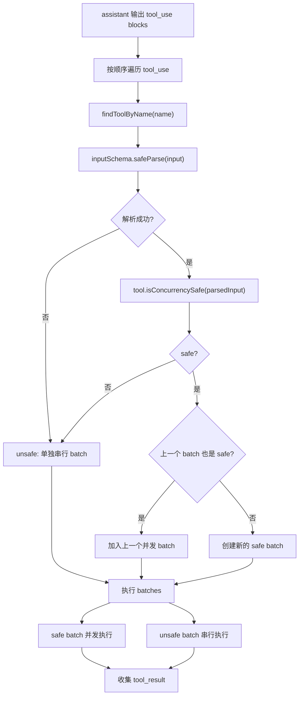

### 6.6 Batch 切分示意图

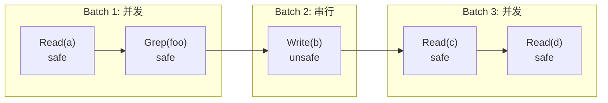

## 7. 普通工具执行 vs 流式工具执行

Claude Code 有两种工具执行模式：

```text
普通模式 runTools()
流式模式 StreamingToolExecutor
```

### 7.1 普通模式

普通模式是：

```text
模型完整输出 assistant message
  -> runtime 收集所有 tool_use
  -> 开始执行工具
  -> 生成 tool_result
  -> 下一轮模型请求
```

时间线：

```text
[模型输出 3s] -> [工具执行 2s] = 约 5s
```

```mermaid
gantt
    title 普通工具执行时间线
    dateFormat X
    axisFormat %s
    section 普通模式
    模型 streaming 输出 :model, 0, 3
    工具执行           :tool, 3, 2
    下一轮模型请求     :next, 5, 1
```

### 7.2 流式工具执行

模型输出是 streaming 的，不是一次性返回完整 message。

流式模式中：

```text
模型正在 streaming 输出
  -> runtime 一旦看到完整 tool_use
  -> 立刻提前启动工具
  -> 当前 assistant message 结束后，收集 tool_result
  -> 下一轮模型请求
```

时间线：

```text
模型输出: [--------3s--------]
工具执行:      [---2s---]
总耗时: 约 3s
```


核心收益：

```text
模型还在输出时，工具已经开始跑。
```

### 7.3 关键限制

流式工具执行不是把工具结果塞回当前模型请求。

当前模型请求的输入在请求开始时已经固定了，streaming 只是输出 token 的方式，不是双向持续对话通道。

所以：

```text
工具可以提前跑
但 tool_result 仍然只能进入下一轮模型请求
```

可以记住一句面试式表达：

```text
Streaming output is not interactive input.
```

中文理解：

```text
流式输出不等于可以流式追加输入。
```

### 7.3.1 流式执行不是同轮注入

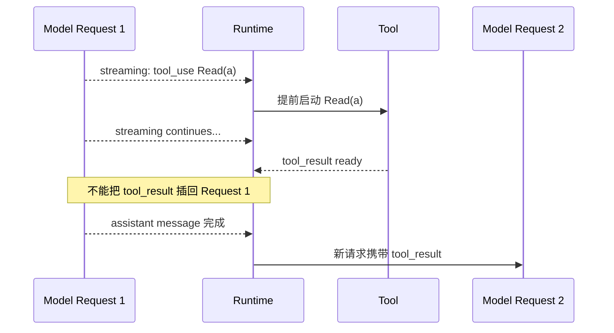

### 7.4 为什么不永远使用流式模式

普通模式：

```text
稳定
简单
状态容易维护
错误处理容易
```

流式模式：

```text
延迟更低
但实现复杂
```

流式模式需要处理：

```text
工具结果缓冲
用户中断
模型 fallback
orphan tool_result
并发安全
结果顺序
unsafe 工具排队
```

所以它通常作为性能优化，通过 feature gate 控制。

### 7.5 gate 灰度开启

`gate` 是功能开关。

`灰度` 是只给一部分用户或环境开启。

目的：

```text
新功能先小范围启用
观察稳定性和性能
有问题可以快速关闭
稳定后再逐步扩大范围
```

可以理解成：

```text
普通模式 = 老方案
流式工具执行 = 新优化
gate = 控制是否启用新优化的闸门
灰度 = 先开一条小缝，再慢慢开大
```

## 8. 一次模型调用包含什么

一次模型调用不是：

```text
用户输入 -> 模型
```

而是：

```text
system prompt + tools + messages + context -> 模型
```

主要包含五大件：

1. systemPrompt
2. messages
3. tools
4. userContext
5. systemContext

### 8.1 请求组装图

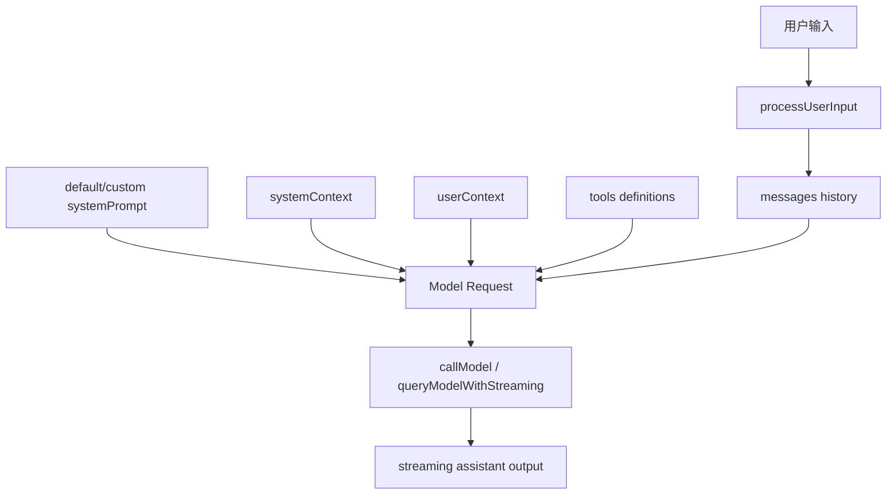

### 8.1.1 一次用户输入不等于一次模型请求

一次用户输入会触发一个用户 turn，但这个 turn 内部可能包含多次模型请求。

```text
用户输入一次
  -> 模型请求 1：模型输出 tool_use
  -> runtime 执行工具
  -> 模型请求 2：带上 tool_result，模型继续
  -> 如果又有 tool_use
  -> 模型请求 3
  -> ...
  -> 最终回答
```

所以“请求体结构”指的是 agent loop 内部某一轮 `callModel()` 的模型可见上下文，而不是整个 agent 运行的全部。

第一次模型请求可能是：

```text
system:
  default systemPrompt
  + appendSystemPrompt
  + systemContext

messages:
  user(meta): <project-instructions>CLAUDE.md...</project-instructions>
  user(meta): <system-reminder>currentDate...</system-reminder>
  user: 用户真实输入

tools:
  Read / Edit / Bash / Grep / ...
```

工具执行后的下一轮模型请求会变成：

```text
system:
  default systemPrompt
  + appendSystemPrompt
  + systemContext

messages:
  user(meta): <project-instructions>CLAUDE.md...</project-instructions>
  user(meta): <system-reminder>currentDate...</system-reminder>
  user: 用户真实输入
  assistant: tool_use(...)
  user: tool_result(...)

tools:
  Read / Edit / Bash / Grep / ...
```

完整真实请求还会包含更多字段：

```text
model
thinking config
max tokens
tool choice
metadata
betas
cache config
```

### 8.2 systemPrompt

定义 agent 的身份、规则和行为边界：

```text
你是谁
你是 coding agent
你有哪些工具
如何使用工具
如何遵守权限规则
不要乱改用户文件
```

默认 system prompt 来自 Claude Code 的基础 prompt。它定义产品级全局规则，例如：

```text
你是一个 interactive software engineering agent
如何使用工具
如何处理权限
如何完成任务
如何避免危险操作
如何报告结果
如何处理 hooks
上下文会自动压缩
```

最终使用哪个 system prompt 由 `buildEffectiveSystemPrompt()` 决定。优先级来自源码注释和分支顺序，可以理解为：

```text
overrideSystemPrompt
  > coordinator prompt
  > agent-specific prompt
  > customSystemPrompt
  > default systemPrompt
  + appendSystemPrompt
```

其中：

```text
overrideSystemPrompt:
  最高优先级，直接替换其他 prompt

customSystemPrompt:
  用户或调用方指定的 system prompt，替换默认 prompt

appendSystemPrompt:
  追加到最终 system prompt 后面

agent-specific prompt:
  某些 agent 类型自己的领域指令

coordinator prompt:
  coordinator mode 下的特殊系统提示词
```

### 8.3 messages

对话历史，也是 agent loop 的主体：

```text
用户输入
assistant 普通回答
assistant tool_use
user tool_result
compact boundary
attachment messages
```

### 8.4 tools

模型可见的工具定义：

```text
工具名
工具描述
输入参数 JSON schema
```

模型根据这些 schema 输出合法的 `tool_use`。

### 8.4.1 Tool 对象到模型 schema 的流转图

Claude Code 内部不是只有一个“JSON schema 表”。更准确地说：

```text
runtime 里保存完整 Tool 对象。
模型请求里只暴露 ToolSchema 投影。
```

完整 Tool 对象很厚，包含：

```text
name
prompt / description
inputSchema / inputJSONSchema
call()
validateInput()
checkPermissions()
isConcurrencySafe()
isReadOnly()
render / mapToolResult...
```

模型看到的 schema 很薄，主要是：

```text
name
description
input_schema
```

流程图：

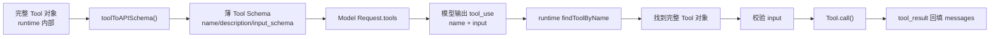

核心句：

```text
厚对象在 runtime，薄 schema 给模型。
```

### 8.4.2 工具过滤机制总览图

Claude Code 的工具过滤不是单点逻辑，而是两层过滤：

```text
第一层：工具池阶段，过滤完整 Tool 对象。
第二层：API 请求阶段，过滤最终给模型看的 tools schema。
```

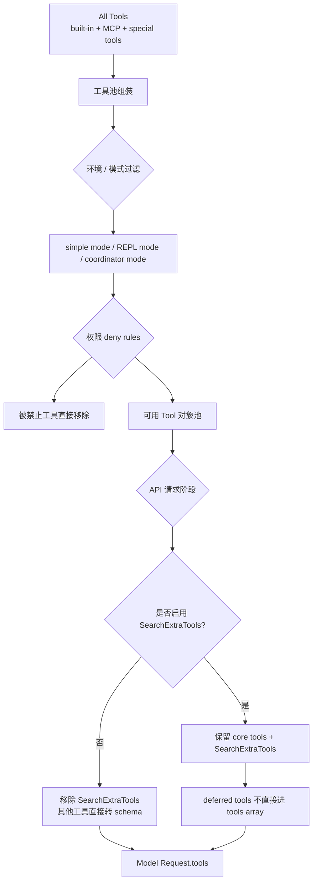

这样做的目的：

```text
省上下文
减少模型选错工具
保持 prompt cache 稳定
支持 MCP 工具动态变化
```

### 8.4.3 动态工具加载图

当工具很多时，Claude Code 不一定把所有工具 schema 都一次性给模型。

可以把工具分成三类：

```text
core tools:
  常驻工具，模型每轮都能看到，可以直接调用

deferred tools:
  按需工具，模型需要先 SearchExtraTools 发现，再 ExecuteExtraTool 执行

disabled / denied tools:
  当前环境不可用，模型最好连看到都别看到
```

动态工具加载流程：

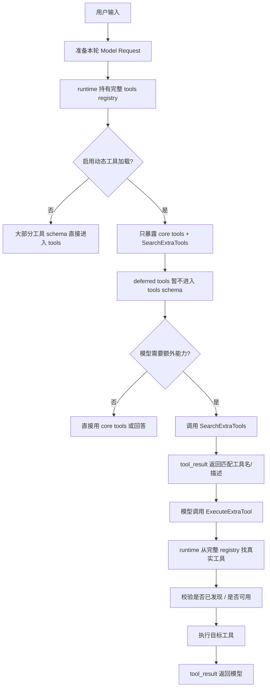

面试表达：

```text
Claude Code uses a two-level tool exposure model:
the runtime keeps the full tool registry,
while each model request receives only a filtered schema view.
Core tools are exposed directly; deferred tools are discovered through SearchExtraTools
and executed through ExecuteExtraTool.
```

### 8.5 userContext

偏“当前用户/项目状态”的上下文：

```text
当前工作目录
项目说明
CLAUDE.md / .claude/rules
平台信息
用户配置
currentDate
```

`userContext` 会被 prepend 到 messages 前面。

`CLAUDE.md` 会被特殊处理为高权重 meta user message：

```text
user(meta):
  <project-instructions>
    CLAUDE.md 内容
  </project-instructions>
```

其他上下文，例如 `currentDate`，会被包进：

```text
user(meta):
  <system-reminder>
    # currentDate
    Today's date is ...
  </system-reminder>
```

关键点：

```text
CLAUDE.md 不是直接变成 default systemPrompt。
它是项目/用户侧指令，通过 userContext 注入到 messages 前面。
```

### 8.6 systemContext

偏 runtime 或系统注入的上下文。

可以先粗略理解为：

```text
runtime 补充给 system prompt 的额外信息
```

典型内容：

```text
gitStatus
cacheBreaker
```

`systemContext` 会 append 到 system prompt 后面。

最终请求可以理解为：

```text
Model(
  system = systemPrompt + systemContext,
  messages = userContext + messagesHistory,
  tools = toolsDefinitions
)
```

### 8.7 userContext 和 systemContext 的区别

```text
systemContext:
  追加到 system prompt 的运行时/系统级信息

userContext:
  prepend 到 messages 前面的用户侧/项目侧上下文
```

源码层面的抽象是：

```text
fullSystemPrompt = appendSystemContext(systemPrompt, systemContext)
messagesForModel = prependUserContext(messagesForQuery, userContext)
```

对比表：

| 类型 | 来源 | 注入位置 | 例子 | 作用 |
|---|---|---|---|---|
| `systemPrompt` | Claude Code 默认 prompt / custom prompt | `system` | 你是 coding agent、如何使用工具 | 定义 agent 基础行为 |
| `systemContext` | runtime 采集 | `system` 后缀 | gitStatus、cacheBreaker | 给 system prompt 补充环境快照 |
| `userContext` | 用户/项目上下文 | messages 前缀 | CLAUDE.md、currentDate | 给模型项目规则和当前上下文 |
| `messages` | 对话/工具循环 | messages 正文 | user、assistant、tool_result | agent loop 主体 |

为什么 `gitStatus` 属于 `systemContext`：

```text
它是 runtime 在会话开始时采集的环境快照，
例如当前分支、主分支、dirty 状态、最近 commit。
它不是用户自然语言输入，也不是项目规则文件。
```

为什么 `CLAUDE.md` 属于 `userContext`：

```text
它本质上是用户/项目给 agent 的本地工作说明，
例如项目约定、测试要求、提交规范、禁止事项。
```

为什么 `currentDate` 也在 `userContext`：

```text
它是模型回答用户问题时可能用到的上下文，
不是 agent 基础行为规则。
```

### 8.8 REPL 与 QueryEngine 的位置

`REPL` 是 `Read-Eval-Print Loop` 的缩写。在 Claude Code 里，它指交互式终端界面。

REPL 路径负责：

```text
输入框
消息展示
权限确认
工具调用进度
流式输出
快捷键
继续对话
```

可以理解为：

```text
REPL = 用户在终端交互界面里使用 Claude Code 时走的 UI 路径
```

`QueryEngine` 是 SDK/headless 场景下的 turn 级控制器。

它位于：

```text
用户输入之后
真正 agent loop 之前
```

职责：

```text
处理用户输入
组装 systemPrompt / userContext / systemContext
准备 messages
构造 ToolUseContext
调用 query()
把 queryLoop 产出的消息转成 SDK/headless 输出
记录 transcript / usage / permission denials
```

关系图：

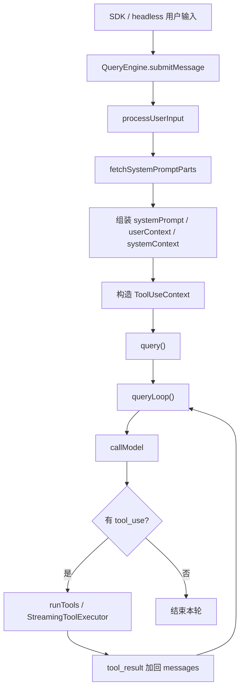

关键区别：

```text
用户 turn 级别：QueryEngine
agent loop 级别：queryLoop
```

一次用户输入：

```text
QueryEngine.submitMessage() 一次
  -> queryLoop 可能多次模型调用
  -> 多次 tool_use / tool_result
  -> 最终回答
```

工具返回后不会重新回到 `QueryEngine` 组装整套 prompt；同一个用户 turn 内部的 model-tool-model 循环发生在 `queryLoop()` 中，主要变化的是 `messages`。

## 9. Context Compression

Context compression / compaction 是从玩具 agent 走向长期可用 agent 的关键机制。

agent 跑久后会积累大量上下文：

```text
用户消息
assistant 输出
tool_use
tool_result
文件内容
命令输出
错误日志
附件
```

如果不压缩，会出现：

```text
超过上下文窗口
成本越来越高
模型被无关历史干扰
长任务无法继续
```

压缩机制要解决：

```text
当前会话太长了，如何塞进模型窗口？
```

基本思路：

```text
完整历史 -> 压缩摘要 -> 保留关键事实 / 决策 / 文件状态 / 待办
```

Claude Code 这类系统中可能包含多种压缩策略：

```text
auto compact
microcompact
reactive compact
history snip
context collapse
```

后续学习重点：

```text
什么时候触发压缩
压缩保留哪些信息
哪些消息不能丢
tool_use / tool_result 配对如何保持一致
压缩后如何继续 agent loop
```

### 9.1 上下文压缩位置图

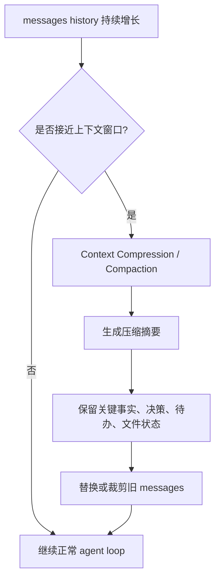

## 10. Memory Management

Memory management 解决的是跨会话、跨任务的长期记忆问题。

它和 compaction 的区别：

```text
compaction:
  当前会话太长了，如何压缩后继续？

memory:
  哪些信息下次任务还应该记得？
```

长期记忆可能包括：

```text
用户偏好
项目约定
常用命令
架构知识
踩过的坑
长期目标
文件/模块含义
历史决策
```

可以把 agent 的信息系统分成三层：

```text
短期上下文 messages
  当前任务正在发生什么

中期压缩 compaction
  当前长任务的摘要和关键状态

长期记忆 memory
  跨任务、跨会话仍然有价值的信息
```

一句话：

```text
tools 让 agent 能做事；
compaction 和 memory 让 agent 能长期做事。
```

### 10.1 信息层级图

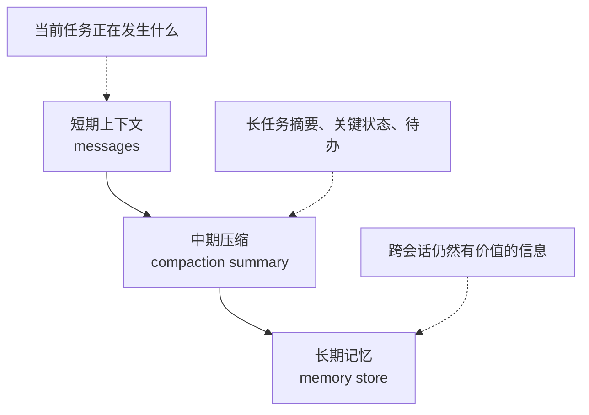

### 10.2 生产级 Agent 总览图

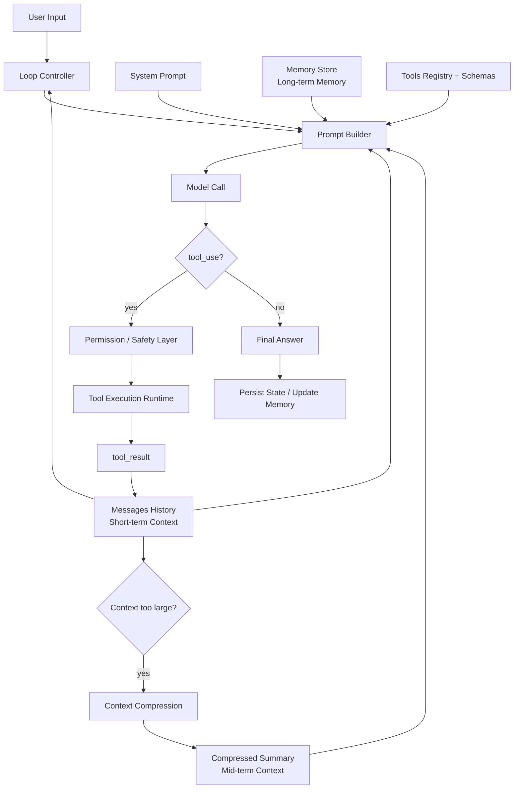

## 11. 为什么学习 Claude Code 范式

学习 Claude Code 的重点不是抄 TypeScript 代码，而是学习成熟 agent runtime 的设计模式。

这些模式可以迁移到其他语言：

```text
Python
Go
Rust
Java
C#
TypeScript
```

也可以迁移到其他 agent 类型：

```text
数据分析 agent
浏览器操作 agent
客服 agent
运维 agent
财务报表 agent
知识库检索 agent
游戏 NPC agent
机器人控制 agent
求职研究 agent
```

面试或项目展示时，真正有价值的是能讲清楚：

```text
agent loop 怎么设计
tools 怎么注册和调度
tool schema 怎么约束模型输出
权限和安全怎么做
上下文爆了怎么办
长期记忆怎么设计
失败和重试怎么处理
如何观察 agent 每一步做了什么
```

目标不是“我会调 API”，而是：

```text
我理解 agent runtime 的核心工程设计，并能实现一个可运行、可调试、可扩展的 agent 系统。
```

## 12. 自己的 Agent 项目方向

一个适合求职展示的项目方向：

```text
Research Agent for Internship Search
```

目标：

```text
帮助用户搜索 agent 应用开发实习，读取 JD，分析要求，匹配技能，生成学习和投递计划。
```

可以支持的工具：

```text
web_search
fetch_page
save_note
query_memory
summarize_company
rank_jobs
draft_email
```

可以展示的 agent runtime 能力：

```text
tool use
agent loop
memory
context compression
structured output
human approval
persistence
trace/debug UI
```

README 应重点写设计，而不是只写功能：

```text
Architecture
Agent Loop
Tool Calling Protocol
Context Management
Memory Design
Safety / Permission
Failure Recovery
Observability
Trade-offs
```

### 12.1 Kgent V0.1 最小落地图

Kgent 的第一版不追求完整复刻 Claude Code，而是先证明最核心闭环：

```text
Frontend -> FastAPI -> agent loop -> model/tool runtime -> JSON response
```

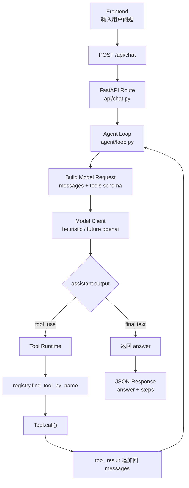

V0.1 的验收目标：

```text
纯文本问题：直接回答
计算问题：calculator tool_use -> tool_result -> final answer
读文件问题：read_file tool_use -> tool_result -> final answer
```

### 12.2 Kgent 版本演进路线图

Kgent 应该按“每学一个 CC 机制，就做一个简化版”的方式演进：

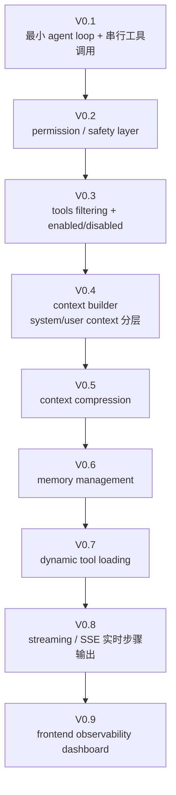

每个版本都应该包含：

```text
DEV_SPEC 更新
最小实现
测试用例
README 中的设计说明
与 Claude Code 范式的对照说明
```

### 12.3 学习到实现的闭环

后续每次学习 Claude Code 的一个机制，都不要只停留在“看懂源码”，而要转成 Kgent 的工程任务：

```mermaid
flowchart LR
    A["提出问题\n例如：工具过滤怎么做?"] --> B["读 Claude Code 源码"]
    B --> C["提炼设计动机\n为什么需要它?"]
    C --> D["画流程图 / 架构图"]
    D --> E["写入学习笔记"]
    E --> F["更新 Kgent DEV_SPEC"]
    F --> G["实现简化版"]
    G --> H["写测试证明机制跑通"]
    H --> I["沉淀 README / 面试表达"]
```

一句话：

```text
claude-code 负责看懂顶级设计；
Kgent 负责把设计变成自己的工程能力。
```

## 13. 当前已掌握内容

目前已经掌握：

1. agent loop 的最小模型：`Model -> Tool -> Model -> Final Answer`
2. agent 内部消息角色：system / user / assistant / tool_result
3. `tool_result` 为什么作为 user message 返回给模型
4. `assistant = 意图`，`tool_result = 观察`
5. 模型只提出 `tool_use`，不直接执行工具
6. runtime 负责查找、校验、权限判断、执行工具
7. 工具并发不是模型决定，而是 runtime 根据工具定义判断
8. `isConcurrencySafe(input)` 是工具并发安全判断的核心
9. 默认并发策略是保守的：没声明 safe 就按 unsafe 处理
10. 普通工具执行会按模型输出顺序切 batch
11. 连续 safe 工具可以并发，unsafe 工具单独串行
12. 流式工具执行可以提前启动工具，降低 latency
13. 流式工具执行不能把 tool_result 塞回当前模型请求
14. `Streaming output is not interactive input`
15. gate / 灰度开启是工程发布策略，用于控制高复杂度优化的启用范围
16. context compression 和 memory management 是长期可用 agent 的关键能力
17. 一次模型调用不是单条用户输入，而是 `systemPrompt + tools + messages + userContext + systemContext + options`
18. 一次用户输入不等于一次模型请求；一个用户 turn 内部可能有多轮 `callModel()`
19. `systemPrompt` 来源有优先级：override / coordinator / agent / custom / default / append
20. `REPL` 是交互式终端 UI 路径，`QueryEngine` 是 SDK/headless 的 turn 级控制器
21. `QueryEngine` 每次用户输入触发一次，`queryLoop` 在一次输入内可能循环多次
22. `systemContext` append 到 system prompt，典型内容是 `gitStatus`
23. `userContext` prepend 到 messages 前，典型内容是 `CLAUDE.md` 和 `currentDate`
24. `CLAUDE.md` 不是 default system prompt，而是高权重 meta user message：`<project-instructions>...</project-instructions>`

## 14. 下一步学习计划

下一阶段建议学习：

1. tools schema 如何传给模型
2. 模型如何根据 tool schema 生成合法的 `tool_use`
3. 工具 registry 如何组装和过滤可用工具
4. MCP tools / deferred tools / built-in tools 的区别
5. 一次 `callModel()` 请求的完整 tool 参数结构

之后进入：

1. Context Compression / Compaction
2. Memory Management
3. Persistence / Resume
4. Observability / Trace
5. Error Recovery / Retry
