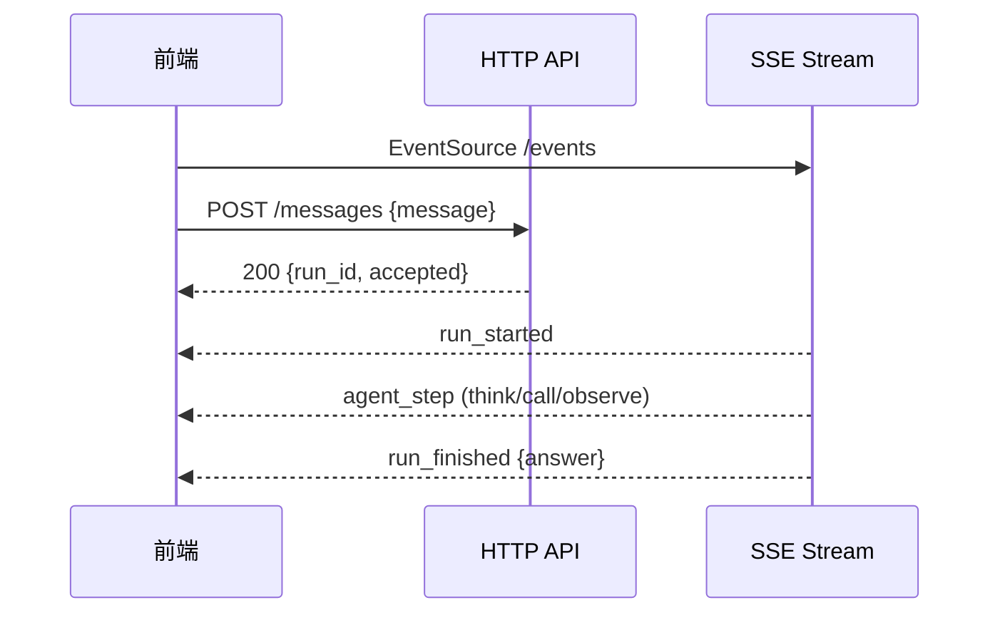

# Kgent Runtime API 文档

> 版本：V0.5（Session Persistence & Transcript Replay）  
> 开发基础 URL：`http://127.0.0.1:8000`（HTTP）或 `https://127.0.0.1:8443`（uvicorn / `scripts/run_server.py` 直挂 TLS 时）  
> 路由实现：`backend/app/main.py`（挂载）· `backend/app/api/sessions.py`（命令）· `backend/app/api/events.py`（SSE）

## 概述

Kgent 前端主链路采用 **HTTP POST 发命令 + SSE 收事件**：

- **HTTP**：提交用户消息、权限决策、取消 run（立即返回，不阻塞等待最终答案）
- **SSE**：推送 agent 步骤级 `AgentEvent`（思考、工具调用、权限请求、最终答案等）

```text
POST /api/sessions                         →  创建/确认 session id（可选）
GET  /api/sessions                         →  侧边栏 session 列表
GET  /api/sessions/{session_id}            →  session 元数据
GET  /api/sessions/{session_id}/transcript →  完整 JSONL transcript 回放
POST /api/sessions/{session_id}/messages   →  启动 run
GET  /api/sessions/{session_id}/events     →  SSE 事件流
POST /api/runs/{run_id}/permission         →  权限 allow/deny
POST /api/runs/{run_id}/cancel             →  取消 run
GET  /health                               →  健康检查
```

---

## 启动服务

**HTTP（本地开发）**

```bash
cd backend
uvicorn app.main:app --reload --host 127.0.0.1 --port 8000
```

或从仓库根目录（读取 `.env`，含可选 TLS）：

```bash
python scripts/run_server.py
```

**HTTPS（任选其一）**

```bash
# 方式 A：scripts/run_server.py（在 .env 中设置 KGENT_SSL_KEYFILE / KGENT_SSL_CERTFILE）
python scripts/run_server.py

# 方式 B：uvicorn 直接 TLS（需证书）
uvicorn app.main:app --host 0.0.0.0 --port 8443 \
  --ssl-keyfile ./certs/key.pem --ssl-certfile ./certs/cert.pem

# 方式 C：生产推荐 —— Caddy / nginx 终止 TLS，反代到本地 HTTP :8000
```

前端开发时，Vite 会把 `/api` 和 `/health` 代理到 `8000`。前端默认**不设置** `VITE_API_BASE`，使用同源相对路径（`/api/...`），避免 `new URL("/api/...")` 在浏览器中报 `Invalid URL`。

生产直连后端时设置 `VITE_API_BASE=https://your-host.example`（无尾斜杠）。

---

## 通用约定

### Content-Type

所有 HTTP JSON 请求/响应使用 `application/json; charset=utf-8`。

### 错误响应

失败时返回统一 envelope（FastAPI 包装在 `detail` 字段内）：

```json
{
  "detail": {
    "error": {
      "type": "validation_error | not_found | conflict | run_not_active | permission_not_pending | internal_error",
      "message": "human readable message",
      "details": {}
    }
  }
}
```

### HTTP 状态码

| 状态码 | 含义 |
|--------|------|
| `200` | 成功 / 命令已接受 |
| `400` | 参数校验失败（空 message、非法 session_id 等） |
| `404` | session / run / permission_request 不存在 |
| `409` | 冲突（session 已有 active run、run 已结束、权限已处理等） |
| `500` | 服务端内部错误 |

### session_id 规则

路径中的 `session_id` 必须匹配：`^[A-Za-z0-9_-]{1,80}$`

**安全说明（V0.2）**：SSE 与 HTTP 命令接口目前**仅以 session_id 区分会话，无鉴权**。本地开发可接受；若将 HTTPS 作为对外入口，应：

- 前端启动时调用 `POST /api/sessions` 获取随机 id（默认 Web 客户端已这样做，并持久化到 `localStorage`）；
- 或通过 `VITE_SESSION_ID` 显式指定共享 session（仅适合单人调试）；
- 生产环境仍需后续增加 token / cookie 鉴权，否则知道 session id 的客户端可订阅同一事件流。

---

## HTTP 接口

### GET /health

健康检查与运行时状态。

**响应 200**

```json
{
  "status": "ok",
  "provider": "openai",
  "available_providers": ["openai"],
  "model_client_ready": true,
  "permission_mode": "interactive",
  "effective_permission_mode": "interactive",
  "tool_risks": {
    "calculator": "low",
    "list_files": "low",
    "read_file": "medium"
  }
}
```

`effective_permission_mode` 当前与 `permission_mode` 相同（保留字段，便于后续 API 路径与 CLI 行为分化）。

---

### POST /api/sessions

创建或确认 session id（可选）。

**请求体**

```json
{}
```

或指定 id：

```json
{ "session_id": "web-default" }
```

**响应 200**

```json
{ "session_id": "sess_a1b2c3d4e5f6" }
```

不传 `session_id` 时服务端自动生成 `sess_{12位hex}`，并写入 `.kgent/sessions/session_index.json`。

**错误**

| 状态码 | 场景 |
|--------|------|
| `400` | 指定的 `session_id` 不符合 `^[A-Za-z0-9_-]{1,80}$` |

---

### GET /api/sessions

返回本地持久化的 session 列表（按 `updated_at` 降序），供前端侧边栏使用。

**响应 200**

```json
{
  "sessions": [
    {
      "session_id": "sess_abc",
      "title": "讲解项目结构",
      "first_prompt": "讲解项目结构",
      "last_prompt": "继续",
      "project_root": "D:/Kgent",
      "created_at": "2026-05-22T10:00:00Z",
      "updated_at": "2026-05-22T11:00:00Z",
      "message_count": 12,
      "event_count": 40
    }
  ]
}
```

---

### GET /api/sessions/{session_id}

返回单个 session 的元数据。

**错误**

| 状态码 | 场景 |
|--------|------|
| `404` | 未知 session |

---

### GET /api/sessions/{session_id}/transcript

返回完整 transcript entries（JSONL 反序列化）。损坏行跳过并在 `warnings` 中报告。

**响应 200**

```json
{
  "session_id": "sess_abc",
  "entries": [
    {
      "entry_id": "evt_1",
      "type": "message",
      "created_at": "2026-05-22T10:00:00Z",
      "project_root": "D:/Kgent",
      "schema_version": 1,
      "payload": {
        "role": "user",
        "content": "hello",
        "is_meta": false
      }
    }
  ],
  "warnings": []
}
```

**错误**

| 状态码 | 场景 |
|--------|------|
| `404` | 未知 session |
| `409` | transcript 超过 `KGENT_TRANSCRIPT_MAX_BYTES`（`transcript_too_large`） |

持久化目录默认 `<project_root>/.kgent`，可通过 `KGENT_STORAGE_DIR` 配置；`KGENT_DISABLE_PERSISTENCE=1` 禁用写入。

---

### POST /api/sessions/{session_id}/messages

提交用户消息并**异步**启动一次 agent run。

> HTTP 响应**不包含**最终 answer；结果通过 SSE 的 `run_finished` 事件推送。

**请求体**

```json
{
  "message": "read README.md and summarize",
  "client_message_id": "msg_client_001"
}
```

| 字段 | 必填 | 说明 |
|------|------|------|
| `message` | 是 | 用户输入，trim 后不能为空 |
| `client_message_id` | 否 | 客户端去重 / 乐观 UI 预留字段；**当前服务端忽略** |

**响应 200**

```json
{
  "run_id": "run_x1y2z3",
  "session_id": "web-default",
  "accepted": true
}
```

**错误**

| 状态码 | 场景 |
|--------|------|
| `400` | message 为空，或 `session_id` 非法 |
| `409` | 同一 session 已有 active run |
| `500` | model client 初始化失败 |

**约束**

- 同一 `session_id` 同时只允许一个 active run
- HTTP 成功仅表示「命令被接受」，终态以 SSE 为准

---

### POST /api/runs/{run_id}/permission

提交工具权限决策（配合 SSE 的 `permission_required` 事件）。

**请求体**

```json
{
  "permission_request_id": "perm_abc123",
  "decision": "allow"
}
```

| 字段 | 说明 |
|------|------|
| `permission_request_id` | 来自 SSE `permission_required` 事件 |
| `decision` | `"allow"` 或 `"deny"` |

**响应 200**

```json
{
  "run_id": "run_x1y2z3",
  "accepted": true
}
```

**错误**

| 状态码 | 场景 |
|--------|------|
| `404` | 未知 run_id 或 permission_request_id |
| `409` | run 已取消 / 已结束 / 权限已处理 |

---

### POST /api/runs/{run_id}/cancel

取消运行中或等待权限的 run。

**请求体**

```json
{}
```

**响应 200**

```json
{
  "run_id": "run_x1y2z3",
  "accepted": true
}
```

**幂等性**

- run 已是 `cancelled` → 仍返回 `200 accepted=true`
- run 已是 `completed` / `failed` → 返回 `409 conflict`

取消后 SSE 会推送 `run_cancelled`；等待权限期间取消会拒绝后续 permission 请求。

---

## SSE 事件流

### GET /api/sessions/{session_id}/events

服务端到客户端的单向事件流（步骤级 runtime 事件，**不是**模型 token 流式输出）。

**响应头**

```http
Content-Type: text/event-stream
Cache-Control: no-cache
Connection: keep-alive
```

**Query 参数**

| 参数 | 说明 |
|------|------|
| `from_seq` | 从该 seq 之后开始推送（与 `Last-Event-ID` 二选一，优先于 header） |

**请求头**

| Header | 说明 |
|--------|------|
| `Last-Event-ID` | 浏览器 `EventSource` 断线重连时自动携带 |

**SSE 格式**

```text
id: 1
event: agent_event
data: {"type":"run_started","run_id":"run_x","session_id":"web-default","seq":1,"created_at":"2026-05-22T12:00:00.000Z","payload":{}}

id: 2
event: agent_event
data: {"type":"agent_step","run_id":"run_x","session_id":"web-default","seq":2,"created_at":"...","payload":{"step":{...}}}
```

- 每条事件的 `id:` 等于 JSON 内的 `seq`
- 前端用浏览器原生 `EventSource` 订阅，`event` 类型固定为 `agent_event`
- 空闲时每 **15 秒**发送 `heartbeat`（不写入历史，仅保活）

**断线重连**

1. 服务端维护 session 级事件历史（条数上限 `KGENT_SESSION_EVENT_MAX`，非法 env 回退 `500`）
2. 重连时从 `from_seq` 或 `Last-Event-ID` 之后补发
3. 前端必须以 `seq` 单调递增去重
4. **重放历史中的 `loop_checkpoint`** 会去掉 `messages` / `tool_schemas`（减小内存）；**实时推送**仍带完整 payload

---

## AgentEvent 协议

SSE `data:` 中的 JSON 统一 envelope：

```json
{
  "type": "agent_step",
  "session_id": "web-default",
  "run_id": "run_x1y2z3",
  "seq": 2,
  "created_at": "2026-05-22T12:00:00.000Z",
  "payload": {}
}
```

| 字段 | 说明 |
|------|------|
| `type` | 事件类型（见下表） |
| `session_id` | 必须与 SSE 路径中的 session_id 一致 |
| `run_id` | run 相关事件必填；heartbeat 可为空 |
| `seq` | session 内严格递增，从 1 开始 |
| `created_at` | ISO-8601 UTC |
| `payload` | JSON object，随 type 变化 |

### 事件类型

| type | 说明 |
|------|------|
| `run_started` | run 已开始 |
| `loop_checkpoint` | 循环检查点；`before_model_call` 时带 `messages` + `tool_schemas` |
| `agent_step` | 一步 think / call / observe / final |
| `tool_call_started` | 工具即将执行 |
| `permission_required` | 需要用户审批 |
| `permission_resolved` | 权限已决定 |
| `run_finished` | 正常结束，含 `answer` |
| `run_failed` | 异常结束 |
| `run_cancelled` | 用户取消 |
| `error` | 协议或控制命令错误 |
| `heartbeat` | 保活，前端不渲染为消息 |

### 典型 payload 示例

**run_finished**

```json
{
  "type": "run_finished",
  "payload": {
    "answer": "README 的摘要……",
    "message_count": 12,
    "steps": []
  }
}
```

**agent_step（工具调用）**

```json
{
  "type": "agent_step",
  "payload": {
    "step": {
      "type": "call",
      "turn_index": 0,
      "tool_use_id": "toolu_123",
      "tool_name": "read_file",
      "tool_input": { "path": "README.md" },
      "decision": "allow"
    }
  }
}
```

**permission_required**

```json
{
  "type": "permission_required",
  "payload": {
    "permission_request": {
      "permission_request_id": "perm_abc123",
      "run_id": "run_x1y2z3",
      "session_id": "web-default",
      "tool_use_id": "toolu_123",
      "tool_name": "read_file",
      "risk_level": "medium",
      "tool_input": { "path": "README.md" },
      "reason": "risk_level=medium requires user approval"
    }
  }
}
```

**run_failed**

```json
{
  "type": "run_failed",
  "payload": {
    "error": "unexpected runtime failure message"
  }
}
```

**error**（模型/provider 失败、权限命令错误等；`ModelClientError` 走此类型）

```json
{
  "type": "error",
  "payload": {
    "error": "provider request failed"
  }
}
```

> `run_failed` 与 `error` 的 `payload.error` 均为**字符串**；run 进入 `failed` 终态后，同一 session 可再发新 message。

---

## 典型交互流程

### 普通对话（无权限弹窗）



### 权限审批（interactive 模式）

```text
POST /messages
  → SSE run_started
  → SSE permission_required
  → POST /runs/{run_id}/permission {decision: "allow"}
  → SSE permission_resolved
  → SSE agent_step (observe)
  → SSE run_finished
```

### 取消

```text
POST /runs/{run_id}/cancel
  → SSE run_cancelled
```

---

## 前端集成示例

### 初始化 session

Web 客户端默认逻辑（见 `frontend/src/lib/sessionId.ts`）：

```typescript
// 1. VITE_SESSION_ID 环境变量（可选，单人调试）
// 2. localStorage 已有 kgent_session_id
// 3. POST /api/sessions 分配 sess_xxx
// 4. 后端不可达时回退 web-default

const res = await fetch("/api/sessions", {
  method: "POST",
  headers: { "Content-Type": "application/json" },
  body: JSON.stringify({}),
});
const { session_id } = await res.json();
```

### 订阅 SSE

```typescript
const es = new EventSource(`/api/sessions/${sessionId}/events`);

es.addEventListener("agent_event", (msg) => {
  const event = JSON.parse(msg.data);
  if (event.type === "heartbeat") return;
  // 按 seq 去重后更新 UI
});
```

### 发送消息

```typescript
const res = await fetch(`/api/sessions/${sessionId}/messages`, {
  method: "POST",
  headers: { "Content-Type": "application/json" },
  body: JSON.stringify({ message: "hello" }),
});
const { run_id } = await res.json();
```

### 权限决策

```typescript
await fetch(`/api/runs/${runId}/permission`, {
  method: "POST",
  headers: { "Content-Type": "application/json" },
  body: JSON.stringify({
    permission_request_id: permId,
    decision: "allow",
  }),
});
```

---

## 环境变量

| 变量 | 说明 | 默认 |
|------|------|------|
| `KGENT_PROVIDER` | 模型 provider | `openai` |
| `KGENT_MODEL` | 模型名 | `deepseek-chat` |
| `KGENT_API_KEY` | API Key | — |
| `KGENT_BASE_URL` | OpenAI 兼容 base URL | `https://api.deepseek.com` |
| `KGENT_PERMISSION_MODE` | `allow_all` / `risk_based` / `interactive` | `risk_based` |
| `KGENT_MAX_STEPS` | 最大 loop 轮数 | `8` |
| `KGENT_MAX_SESSION_MESSAGES` | session 消息上限 | `100` |
| `KGENT_CORS_ORIGINS` | CORS 允许来源，逗号分隔；未设置=localhost 开发默认（含 http/https :5173）；`*`=全允许且禁用 credentials | localhost 默认 |
| `KGENT_SESSION_EVENT_MAX` | 每 session SSE 重放历史保留条数（`loop_checkpoint` 存历史时会去掉 `messages`/`tool_schemas`）；非法值回退 `500` | `500` |
| `VITE_API_BASE` | 前端 API 根 URL；空=同源相对路径 + Vite proxy | — |
| `VITE_SESSION_ID` | 前端固定 session id（不设则自动 `POST /api/sessions` + localStorage） | — |
| `KGENT_HOST` / `KGENT_PORT` / `KGENT_RELOAD` | `scripts/run_server.py` 监听地址与热重载 | `127.0.0.1` / `8000` / off |
| `KGENT_SSL_KEYFILE` / `KGENT_SSL_CERTFILE` | `scripts/run_server.py` 读取并传给 uvicorn `--ssl-*` | — |
